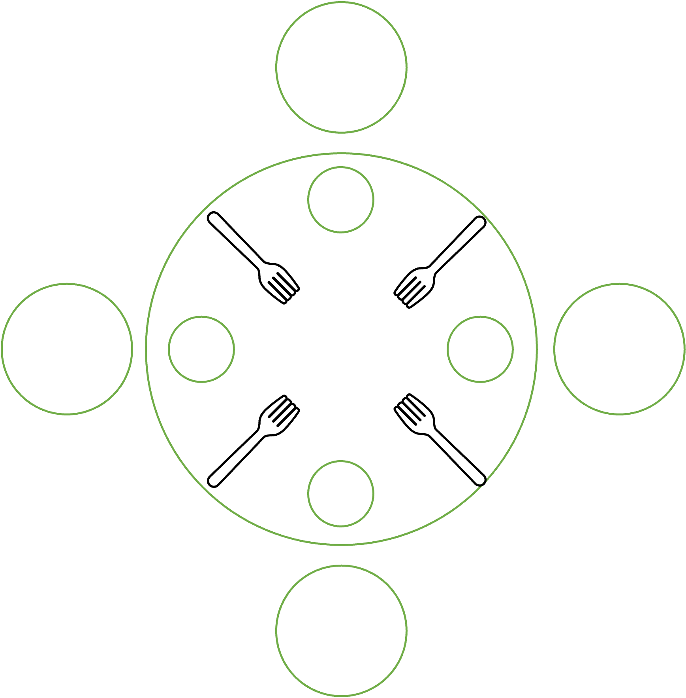

# Synchronization

* We generally use the term *synchronization* to refer to coordinating the execution among different
  threads. Often times, when using threads, careful coordination is necessary to avoid
  difficult-to-debug problems such as data races.
* There are a few synchronization primitives that we can use for coordinating the execution among
  threads, such as locks, condition variables, and semaphores.
* Reference chapters from OSTEP:
    * [Chapter 28 Locks](https://pages.cs.wisc.edu/~remzi/OSTEP/threads-locks.pdf)
    * [Chapter 30 Condition Variables](https://pages.cs.wisc.edu/~remzi/OSTEP/threads-cv.pdf)
    * [Chapter 31 Semaphores](https://pages.cs.wisc.edu/~remzi/OSTEP/threads-sema.pdf)
    * [Chapter 32 Concurrency Bugs](https://pages.cs.wisc.edu/~remzi/OSTEP/threads-bugs.pdf)
    * Keep in mind that OSTEP's discussions are much more in depth, which we consider out of scope
      for this course. Thus, you can use it as a reference but the main source should still be this
      lecture note.

## Locks (Mutexes)

* Consider the data race example discussed previously. Updating `cnt` may appear to be a single
  operation but in reality, it consists of multiple sub-operations, e.g., reading from memory,
  adding `1` to `cnt`, and writing it back to memory. Thus, if you have multiple threads updating
  `cnt` concurrently, these sub-operations run concurrently as well, which means that the
  sub-operations from different threads interleave and mix up with each other during their
  execution. This mix-up of sub-operations is the main source of unexpected/inaccurate results as
  discussed previously.
* To avoid this, we need to be able to prevent this mix-up of sub-operations from different threads.
* A lock or a mutex (for *mut*ual *ex*clusion) is a primitive that gives us this ability.
* Generally, a lock mechanism consists of the following three things.
    * A lock variable that defines a lock.
    * A `lock()` function that grabs a lock.
    * An `unlock()` function that releases a lock.
* For example, the pthread library provides a lock mechanism as follows.
    * `pthread_mutex_t`: the data type to define a lock.
    * `int pthread_mutex_lock(pthread_mutex_t *mutex)`: the lock function that grabs the lock passed
      as the argument.
    * `int pthread_mutex_unlock(pthread_mutex_t *mutex)`: the unlock function that releases the lock
      passed as the argument.
    * Other languages (e.g., Java, Python, etc.) provide similar lock mechanisms with different type
      names and function names.
* The central guarantee of a lock is that *only a single thread can hold a lock*.
    * Let's use pthread's lock mechanism as a concrete example.
    * Let's assume we have a lock named `mutex`, i.e., we have declared `pthread_mutex_t mutex`
      somewhere in our code.
    * If thread `A` calls `lock()` on `mutex`, i.e., `pthread_mutex_lock(&mutex)`, the underlying
      lock mechanism allows thread `A` to grab the lock `mutex`.
    * If thread `B` next calls `pthread_mutex_lock(&mutex)`, the underlying lock mechanism does not
      allow thread `B` to grab the lock `mutex` since thread `A` holds the lock already. The lock
      mechanism allows only a single thread to grab a lock. This is the central guarantee provided
      by the lock mechanism. Now, the lock mechanism *blocks* thread `B` from executing further and
      makes it *wait* until the lock `mutex` becomes available to grab.
    * What blocking means here is that, when thread `B` calls `pthread_mutex_lock(&mutex)`, the call
      *does not return* until `mutex` becomes available to grab.
    * In summary, calling `pthread_mutex_lock(&mutex)` either grabs the lock `mutex` (if no other
      thread holds the lock) or gets blocked and waits (if there is a thread that holds the lock).
    * If thread `A` (that holds the lock `mutex`) calls `unlock()`, i.e.,
      `pthread_mutex_unlock(&mutex)`, the underlying lock mechanism releases the lock and makes it
      available for another thread to grab.
* Even if there are more than two threads, only a single thread can hold a lock and all other
  threads need to wait (if they all call `lock()`) until the lock becomes available.
    * Only one thread at a time can grab a lock and we *can't* control the order in which different
      threads grab the lock. It depends on the underlying lock mechanism.
    * As mentioned previously, this behavior is referred to as *non-deterministic* behavior, i.e.,
      it exhibits different behavior every time it runs. This is as opposed to *deterministic*
      behavior.
* Going back to the data race example, we can use a lock to avoid the mix-up of sub-operations from
  different threads.
    * We can "guard" the region of code that updates `cnt` by calling `lock()` beforehand and
      calling `unlock()` afterward. This way, only a single thread can execute the code and safely
      update `cnt` without worrying about sub-operations getting mixed-up from different threads.
* The following code demonstrates the data race problem.

  ```c
  #include <pthread.h>
  #include <stdio.h>
  #include <stdlib.h>
  #include <string.h>

  int cnt = 0;

  static void *thread_func(void *arg) {
    for (int i = 0; i < 10000000; i++)
      cnt++;
    pthread_exit(0);
  }

  int main(int argc, char *argv[]) {
    pthread_t t1;
    pthread_t t2;

    if (pthread_create(&t1, NULL, thread_func, NULL) != 0)
      perror("pthread_create");

    if (pthread_create(&t2, NULL, thread_func, NULL) != 0)
      perror("pthread_create");

    if (pthread_join(t1, NULL) != 0)
      perror("pthread_join");
    if (pthread_join(t2, NULL) != 0)
      perror("pthread_join");

    printf("%d\n", cnt);

    exit(EXIT_SUCCESS);
  }
  ```

* The following code uses a lock to properly guard the updating of `cnt`. Notice how the lock
  `mutex` is initialized with the initialization macro, `PTHREAD_MUTEX_INITIALIZER`.

  ```c
  #include <pthread.h>
  #include <stdio.h>
  #include <stdlib.h>
  #include <string.h>

  int cnt = 0;
  pthread_mutex_t mutex = PTHREAD_MUTEX_INITIALIZER;

  static void *thread_func(void *arg) {
    for (int i = 0; i < 10000000; i++) {
      pthread_mutex_lock(&mutex);
      cnt++;
      pthread_mutex_unlock(&mutex);
    }
    pthread_exit(0);
  }

  int main(int argc, char *argv[]) {
    pthread_t t1;
    pthread_t t2;

    if (pthread_create(&t1, NULL, thread_func, NULL) != 0)
      perror("pthread_create");

    if (pthread_create(&t2, NULL, thread_func, NULL) != 0)
      perror("pthread_create");

    if (pthread_join(t1, NULL) != 0)
      perror("pthread_join");
    if (pthread_join(t2, NULL) != 0)
      perror("pthread_join");

    printf("%d\n", cnt);

    exit(EXIT_SUCCESS);
  }
  ```

## Lock Usage

* Atomicity
    * Using a lock on a section of code makes all operations within the section *atomic*,
      i.e., all operations would run as if they were a single operation. Going back to the previous
      data race example, if we used a lock for updating `cnt`, all sub-operations (reading from
      memory, updating `cnt`, and writing back to memory) would run without getting any interference
      from other threads' sub-operations. In other words, they would run as if they were a single
      step.
    * Atomicity is sometimes referred to as *all or nothing* as it runs either all operations or no
      operations at all.
* Serialization and interleaving
    * Using a lock effectively *serializes* operations, i.e., only one thread at a time can run the
      operations guarded by a lock.
    * Operations from different threads are *interleaved* in some order. But we can't control the
      order in which different threads run.
* Protecting shared variables
    * Whenever multiple threads share a variable, we need to use a lock to control the access to the
      variable in order to avoid data race problems. Typically in C, a shared variable is a global
      variable.
    * We can also use other synchronization primitives that we will discuss later.
* Multiple locks
    * We do not need to use only one lock to protect shared variables.
    * For example, suppose we have four threads where two threads share a global variable `a` and
      the other two threads share another global variable `b`. We can use two locks, one for `a` and
      another for `b`, to control access. If we use only a single lock, four threads will compete
      for the same lock even if they do not all access the same variable.
    * Reducing *lock contention* is important for performance.
* `pthread_mutex_trylock()` and `pthread_mutex_timedlock()`
    * These functions allows us to control the blocking behavior of `pthread_mutex_lock()`.
    * `pthread_mutex_trylock()`: from the man page, "The `pthread_mutex_trylock()` function shall be
      equivalent to `pthread_mutex_lock()`, except that if the mutex object referenced by mutex is
      currently locked (by any thread, including the current thread), the call shall return
      immediately."
    * `pthread_mutex_timedlock()`: from the man page, "The `pthread_mutex_timedlock()` function
      shall lock the mutex object referenced by mutex. If the mutex is already locked, the calling
      thread shall block until the mutex becomes available as in the `pthread_mutex_lock()`
      function. If the mutex cannot be locked without waiting for another thread to unlock the
      mutex, this wait shall be terminated when the specified timeout expires."

## Critical Section (CS) and Thread Safety

* Critical Section (CS)
    * A critical section is a term that is commonly used in concurrent programming.
    * From OSTEP, "A critical section is a piece of code that accesses a shared variable (or more
      generally, a shared resource) and must not be concurrently executed by more than one thread."
    * If a thread is executing the CS, no other threads should execute the CS.
* An ideal solution for the CS problem must satisfy three requirements:
    * *Mutual exclusion*: Only one thread should be allowed to run in the CS
    * *Progress*: A thread should eventually complete (i.e., make progress).
    * *Bounded waiting*: An upper bound must exist for the amount of time a thread waits to enter
      the CS (i.e., a thread should only be blocked for a finite amount of time).
* Thread safety
    * A *thread safe* function is a function that multiple threads can run safely.
    * A thread safe function either does not access shared resources or provides proper protection
      for its critical sections that access shared resources.
    * A related concept: Reentrant vs nonreentrant functions
        * A reentrant function is a function that produces the correct output even when it is called
          again while executing (via different threads, signal handlers, etc.).
        * Reentrant functions really need to be understood in the context of signal handlers. Signal
          handlers can run on the same thread. I.e., if a function is called by the main function,
          but then also called by a signal handler they run on the same thread. Wikipedia has a good
          example, where you can't simply use a lock to make it work. Wikipedia as [a good
          example](https://en.wikipedia.org/wiki/Reentrancy_(computing)#Neither_reentrant_nor_thread-safe).
          In the example, you can't simply use a lock to make it reentrant, since it's going to
          cause a problem called *deadlock* that we'll discuss below.
        * A common technique to implement a reentrant function: any info returned to the caller or
          maintained across function calls should use caller-allocated buffers. E.g., when calling
          `write()`, we need to allocate a buffer and pass it to the function. This is a common
          technique to make a function reentrant.

## Deadlock and Livelock

* Deadlock
    * A deadlock is a condition where a set of threads each hold a resource and wait to acquire a
      resource held by another thread.
    * The threads get stuck and make no progress.
* Activity
    * Write a program that creates two threads and two locks.
    * Each thread should request two locks in sequence but in a different order.
    * The following code demonstrates this and it could deadlock. (Deadlocks don't always occur due
      to the timing of thread execution. Thus, the following code may not always deadlock. But
      still, it does occur from time to time, which is a problem.)

      ```c
      #include <pthread.h>
      #include <stdio.h>
      #include <stdlib.h>
      #include <unistd.h>

      static pthread_mutex_t mutex0 = PTHREAD_MUTEX_INITIALIZER;
      static pthread_mutex_t mutex1 = PTHREAD_MUTEX_INITIALIZER;

      static void *thread0(void *arg) {
        pthread_mutex_lock(&mutex0);
        printf("thread0: mutex0\n");
        pthread_mutex_lock(&mutex1);
        printf("thread0: mutex1\n");
        pthread_mutex_unlock(&mutex0);
        pthread_mutex_unlock(&mutex1);
        pthread_exit(0);
      }

      static void *thread1(void *arg) {
        pthread_mutex_lock(&mutex1);
        printf("thread1: mutex1\n");
        pthread_mutex_lock(&mutex0);
        printf("thread1: mutex0\n");
        pthread_mutex_unlock(&mutex1);
        pthread_mutex_unlock(&mutex0);
        pthread_exit(0);
      }

      int main() {
        pthread_t t0;
        pthread_t t1;

        if (pthread_create(&t0, NULL, thread0, NULL) != 0)
          perror("pthread_create");

        if (pthread_create(&t1, NULL, thread1, NULL) != 0)
          perror("pthread_create");

        if (pthread_join(t0, NULL) != 0)
          perror("pthread_join");
        if (pthread_join(t1, NULL) != 0)
          perror("pthread_join");

        exit(EXIT_SUCCESS);
      }
      ```

* A deadlock *may* arise when the following conditions hold at the same time. We emphasize again
  that a deadlock may not always occur even if the conditions below hold. This is because it all
  depends on the timing of thread execution.
    * *Hold and wait*: threads are already holding resources but also are waiting for additional
      resources being held by other threads.
    * *Circular wait*: there exists a set {T0, T1, ..., Tn-1} of threads such that T0 is waiting for
      a resource that is held by T1, T1 is waiting for T2, ..., Tn–1 is waiting for T0.
    * *Mutual exclusion*: threads hold resources exclusively.
    * *No preemption*: resource released only voluntarily by the thread holding it
* The above code satisfies these conditions since the `t0` could hold `mutex0` and request `mutex1`,
  while `t1` could hold `mutex1` and request `mutex0`.
* Deadlock prevention: ensuring at least one of the conditions cannot hold.
    * If we can break one of the four conditions from above, we can prevent a deadlock from
      occurring.
* Two potential techniques.
    * Grabbing all locks at once atomically: this breaks the hold-and-wait condition since you grab
      all the locks together or no locks at all. The following code uses another lock to achieve
      this, using the same example from above.

      ```c
      #include <pthread.h>
      #include <stdio.h>
      #include <stdlib.h>
      #include <unistd.h>

      static pthread_mutex_t mutex0 = PTHREAD_MUTEX_INITIALIZER;
      static pthread_mutex_t mutex1 = PTHREAD_MUTEX_INITIALIZER;
      static pthread_mutex_t another_lock = PTHREAD_MUTEX_INITIALIZER;

      static void *thread0(void *arg) {
        pthread_mutex_lock(&another_lock);
        pthread_mutex_lock(&mutex0);
        printf("thread0: mutex0\n");
        pthread_mutex_lock(&mutex1);
        pthread_mutex_unlock(&another_lock);
        printf("thread0: mutex1\n");
        pthread_mutex_unlock(&mutex0);
        pthread_mutex_unlock(&mutex1);
        pthread_exit(0);
      }

      static void *thread1(void *arg) {
        pthread_mutex_lock(&another_lock);
        pthread_mutex_lock(&mutex1);
        printf("thread1: mutex1\n");
        pthread_mutex_lock(&mutex0);
        pthread_mutex_unlock(&another_lock);
        printf("thread1: mutex0\n");
        pthread_mutex_unlock(&mutex1);
        pthread_mutex_unlock(&mutex0);
        pthread_exit(0);
      }

      int main() {
        pthread_t t0;
        pthread_t t1;

        if (pthread_create(&t0, NULL, thread0, NULL) != 0)
          perror("pthread_create");

        if (pthread_create(&t1, NULL, thread1, NULL) != 0)
          perror("pthread_create");

        if (pthread_join(t0, NULL) != 0)
          perror("pthread_join");
        if (pthread_join(t1, NULL) != 0)
          perror("pthread_join");

        exit(EXIT_SUCCESS);
      }
      ```

    * Acquiring locks in the same global order for all threads: this also breaks the circular wait
      condition as all threads try to grab locks in the exact same order.

      ```c
      #include <pthread.h>
      #include <stdio.h>
      #include <stdlib.h>
      #include <unistd.h>

      static pthread_mutex_t mutex0 = PTHREAD_MUTEX_INITIALIZER;
      static pthread_mutex_t mutex1 = PTHREAD_MUTEX_INITIALIZER;

      static void *thread0(void *arg) {
        pthread_mutex_lock(&mutex0);
        printf("thread0: mutex0\n");
        pthread_mutex_lock(&mutex1);
        printf("thread0: mutex1\n");
        pthread_mutex_unlock(&mutex0);
        pthread_mutex_unlock(&mutex1);
        pthread_exit(0);
      }

      static void *thread1(void *arg) {
        pthread_mutex_lock(&mutex0);
        printf("thread1: mutex0\n");
        pthread_mutex_lock(&mutex1);
        printf("thread1: mutex1\n");
        pthread_mutex_unlock(&mutex0);
        pthread_mutex_unlock(&mutex1);
        pthread_exit(0);
      }

      int main() {
        pthread_t t0;
        pthread_t t1;

        if (pthread_create(&t0, NULL, thread0, NULL) != 0)
          perror("pthread_create");

        if (pthread_create(&t1, NULL, thread1, NULL) != 0)
          perror("pthread_create");

        if (pthread_join(t0, NULL) != 0)
          perror("pthread_join");
        if (pthread_join(t1, NULL) != 0)
          perror("pthread_join");

        exit(EXIT_SUCCESS);
      }
      ```

* Livelock
    * A livelock is a condition where a set of threads each execute instructions actively, but they
      still don't make any progress.
    * For example, suppose we have two threads, T0 and T1, each of which attempts to acquire two
      resources, R0 and R1. They run a function that acquires the first resource (either R0 or R1),
      prints a message, then tries to acquire the second resource. If the second resource is not
      available, the function releases the first resource and tries again. Given this function,
      consider a scenario where T0 and T1 runs concurrently. T0 acquires R0 and T1 acquires R1. T0
      then tries to acquire R1 and T1 tries to acquire R0. However, since R0 and R1 are not
      available, T0 releases R0 and tries again, and T1 releases R1 and tries again. T0 and T1
      repeats this sequence forever.
    * In this example, both T0 and T1 actively execute the function but they do not make any
      progress. This is called a livelock.
    * Both deadlocks and livelocks do not make any progress. In a livelock scenario, threads do
      still execute. In a deadlock scenario, threads are stuck and do not execute anything actively.

## Condition Variables

* There is a common programming pattern called producer-consumer.
    * It has a set of threads *producing* data and another set of threads *consuming* the data. (We
      will discuss this more later.)
    * There is typically a shared resource, e.g., a variable or a buffer that these threads access
      for either producing or consuming data.
    * Therefore, the shared resource needs protection.
* Consider the code below that has one producer and one consumer.
    * The producer (`thread_func()`) keeps incrementing the global variable `avail`.
    * The consumer (`main()`) keeps decrementing the global variable `avail` until it reaches
      0.
    * With the producer, we are simulating a scenario where a producer produces one item at a time.
    * With the consumer, we are simulating a scenario where a consumer consumes all available items
      and repeats.
    * We use one mutex to serialize access to `avail`. This avoids potential data race problems.

  ```c
  #include <pthread.h>
  #include <stdio.h>
  #include <stdlib.h>
  #include <unistd.h>

  static pthread_mutex_t mtx = PTHREAD_MUTEX_INITIALIZER;

  static int avail = 0;

  static void *thread_func(void *arg) {
    for (;;) {
      int s = pthread_mutex_lock(&mtx);
      if (s != 0) {
        perror("pthread_mutex_lock");
        pthread_exit((void *)1);
      }
      avail++;

      s = pthread_mutex_unlock(&mtx);
      if (s != 0) {
        perror("pthread_mutex_unlock");
        pthread_exit((void *)1);
      }
      sleep(1);
    }

    return 0;
  }

  int main() {
    pthread_t t1;
    void *res;
    int s;

    s = pthread_create(&t1, NULL, thread_func, NULL);
    if (s != 0) {
      perror("pthread_create");
      exit(1);
    }

    for (;;) {
      s = pthread_mutex_lock(&mtx);
      if (s != 0) {
        perror("pthread_mutex_lock");
        exit(1);
      }

      while (avail > 0) {
        /* This is simulating "consume everything available" */
        avail--;
      }

      s = pthread_mutex_unlock(&mtx);
      if (s != 0) {
        perror("pthread_mutex_unlock");
        exit(1);
      }
    }

    s = pthread_join(t1, &res);
    if (s != 0) {
      perror("pthread_create");
      exit(1);
    }
  }
  ```

* Now, the program avoids data race but it is inefficient.
    * In the main thread, the `for` loop keeps running (i.e., uses the CPU and wastes it) even if
      `avail > 0` is not true. In other words, it keeps checking if there is something to consume
      even if there is nothing to consume.
* A condition variable is a primitive that can address this inefficiency.
    * Using a condition variable, (i) a thread can send a notification to the condition variable,
      and (ii) another thread can wait until a notification is sent to the condition variable.
    * The key point is that the waiting thread, while waiting, goes to sleep and does not use the
      CPU. This means that other processes/threads can utilize the CPU to perform useful work.
* The pthread library provides support for condition variables as follows.
    * `pthread_cond_t`: the data type to define a condition variable.
    * `pthread_cond_signal(pthread_cond_t *cond)`: the function that sends a signal to `cond`. If
      there is a thread waiting on `cond`, this wakes up the thread.
    * `pthread_cond_wait(pthread_cond_t *cond, pthread_mutex_t *mutex)`: the function that waits
      for a signal sent to `cond`.
        * For `mutex`, it behaves like a lock-safe sleep. Internally, it releases `mutex`, waits for
          a signal on `cond`, and (once a signal is sent to `cond`,) wakes up and re-grabs `mutex`.
          In other words, it does not go to sleep while holding a lock.
        * This is because doing so would unnecessarily prevent other threads from grabbing the lock.
        * See the example below for an illustration.
    * `pthread_cond_broadcast(pthread_cond_t *cond)`: the function that wakes up all threads
      waiting on `cond`.
        * The difference is that `pthread_cond_signal()` wakes up just a single thread (out of all
          threads waiting on `cond`)---but we do not have control over which one to wake up.
        * With `pthread_cond_broadcast()`, all threads wake up and try to grab `mutex`, i.e., they
          compete for the lock.
        * If all threads do the same thing and it doesn't matter which thread does the work,
          `pthread_cond_signal()` is the right one to use.
        * If individual threads are expected to do different things, `pthread_cond_broadcast()` is
          the right one to use.
* Consider the following code that does the same thing as before, but with a condition variable.
    * We still use `mutex` to protect the shared variable `avail`.
    * The producer, once it produces one item, sends a signal to `cond` to wake up a waiting thread,
      if any (`s = pthread_cond_signal(&cond)`). This is to notify the other thread that there is
      something to consume.
    * At each iteration, the consumer first checks if there is any available item to consume (the
      new while loop). If nothing's available (`avail == 0`), it goes to sleep. Since it calls
      `pthread_cond_wait()`, it releases `mutex` before going to sleep, which means that other
      threads waiting for the lock can grab the lock and perform some useful work. When the consumer
      wakes up (after the producer signals), it grabs `mutex` again before returning from
      `pthread_cond_wait()`. As explained earlier, these are the internal steps of
      `pthread_cond_wait()`.

  ```c
  #include <pthread.h>
  #include <stdio.h>
  #include <stdlib.h>
  #include <unistd.h>

  static pthread_mutex_t mtx = PTHREAD_MUTEX_INITIALIZER;
  static pthread_cond_t cond = PTHREAD_COND_INITIALIZER;

  static int avail = 0;

  static void *thread_func(void *arg) {
    for (;;) {
      int s = pthread_mutex_lock(&mtx);
      if (s != 0) {
        perror("pthread_mutex_lock");
        pthread_exit((void *)1);
      }
      avail++;

      s = pthread_mutex_unlock(&mtx);
      if (s != 0) {
        perror("pthread_mutex_unlock");
        pthread_exit((void *)1);
      }

      // This signal is new.
      s = pthread_cond_signal(&cond);
      if (s != 0) {
        perror("pthread_cond_signal");
        pthread_exit((void *)1);
      }

      sleep(1);
    }

    return 0;
  }

  int main() {
    pthread_t t1;
    void *res;
    int s;

    s = pthread_create(&t1, NULL, thread_func, NULL);
    if (s != 0) {
      perror("pthread_create");
      exit(1);
    }

    for (;;) {
      s = pthread_mutex_lock(&mtx);
      if (s != 0) {
        perror("pthread_mutex_lock");
        exit(1);
      }

      // This while loop is new.
      while (avail == 0) {
        s = pthread_cond_wait(&cond, &mtx);
        if (s != 0) {
          perror("pthread_mutex_lock");
          exit(1);
        }
      }

      while (avail > 0) {
        /* This is simulating "consume everything available" */
        avail--;
      }

      s = pthread_mutex_unlock(&mtx);
      if (s != 0) {
        perror("pthread_mutex_unlock");
        exit(1);
      }
    }

    s = pthread_join(t1, &res);
    if (s != 0) {
      perror("pthread_create");
      exit(1);
    }
  }
  ```

    * Notice that the consumer uses `while (avail == 0)`, not `if (avail == 0)` to check if there is
      any available item to consume. This means that after it wakes up from `pthread_cond_wait()`,
      it checks again if there is still an available item.
    * This is *necessary* because in `pthread_cond_wait()`, it internally grabs `mutex` before
      returning (as explained earlier). Generally speaking, since this is a lock, there can be
      other threads that can grab the lock and and consume available items. Thus, we always need to
      check again if there are indeed available items to consume using a while loop.
* Thus, using a condition variable generally follows this template.

  ```c
  #include <pthread.h>
  #include <stdio.h>
  #include <stdlib.h>

  static pthread_mutex_t mtx = PTHREAD_MUTEX_INITIALIZER;
  static pthread_cond_t cond = PTHREAD_COND_INITIALIZER;

  int main() {
    int s = pthread_mutex_lock(&mtx);

    if (s != 0) {
      perror("pthread_mutex_lock");
      exit(1);
    }

    while (/* Check if the shared variable is not in the state we want, e.g., if there is nothing to
              consume */)
      /* Use while, not if, for safety. Although pthread_cond_signal should've
       * been called because the shared variable were in the state we want, other
       * threads might have woken up first and changed the shared variable. */
      pthread_cond_wait(&cond, &mtx);

    // Do the necessary work with the shared variable, e.g., consume.

    s = pthread_mutex_unlock(&mtx);
    if (s != 0) {
      perror("pthread_mutex_lock");
      exit(1);
    }
  }
  ```

## Semaphores

* This is another synchronization primitive.
* You can think of a semaphore as a lock with a count.
    * A lock is either available or not available, i.e., binary.
    * A semaphore is more flexible and indicates the availability as a count, i.e., *how many* are
      available.
    * This is useful in scenarios where availability is not binary but a count, e.g., if you have
      available slots. We will look at an example later.
    * If the availability count is 0, it means the semaphore is unavailable.
    * If the availability count is greater than 0, it means the semaphore is available.
    * You first need to initialize the semaphore with the max availability count.
* In pthread, there are three functions to note.
    * `sem_init(sem_t *sem, int pshared, unsigned int value)`: the function that initializes the
      count to `value` for `sem`. `value` is the availability count. `pshared` indicates if `sem` is
      for threads (`0`) or processes (`1`).
    * `sem_wait(sem_t *sem)`: the function that grabs `sem`. Internally, if the count is 0, it
      blocks (i.e., does not return) until the count becomes greater than 0. If the count is (or
      becomes) greater than 0, it decrements the count by one and returns.
    * `sem_post(sem_t *sem)`: the function that "releases" `sem`. Internally, it increments the
      count by one.
    * `sem_init(&sem, 0, 1)` is the same as a mutex.

## Read-Write Lock

* This is also a synchronization primitive.
* A read-write lock allows either unlimited readers or a single writer but not both (XOR).
* In pthread, two functions to note.
    * `pthread_rwlock_rdlock(pthread_rwlock_t *rwlock)`: the function that grabs `rwlock` for
      reading. This allows any threads to grab `rwlock` as long as there is no thread that holds
      `rwlock` for writing (the next function).
    * `pthread_rwlock_wrlock(pthread_rwlock_t *rwlock)`: the function that grabs `rwlock` for
      writing. This allows only one thread to grab `rwlock`.

## Dining Philosophers



* For a detailed description, read the section on dining philosophers in OSTEP's [Chapter 31
  Semaphore](https://pages.cs.wisc.edu/~remzi/OSTEP/threads-sema.pdf).
* Problem Description
    * Philosophers sit at a round table.
    * Philosophers alternate between eating and thinking.
    * In between any two philosophers sitting next to each other, there is a fork.
    * To eat, a philosopher needs two forks (at their left and right). To think, no forks are
      needed.
    * This means that each fork is shared by two philosophers sitting next to each other.
* We can model this problem as a synchronization problem.
    * Each thread is a philosopher.
    * A fork is a shared resource, and needs access control. I.e., coordination is needed to grab
      forks.
* Activity: come up with a solution that protects shared resources correctly and does not deadlock.
    * One big lock (not efficient): we can use one mutex to guard all forks and control access. This
      avoids deadlocks but allows only one philosopher to eat. No other philosophers can eat if one
      philosopher holds a lock.
    * We can try assigning one lock per fork.
    * A wrong solution
        * We can try having all threads grab their right fork and then their left fork.
        * But if every philosopher grabs their right fork at the same time, then no philosophers can
          grab their left fork.
        * This results in a deadlock due to hold-and-wait and circular-wait.
    * Recall: deadlock conditions discussed previously
        * Hold-and-wait
        * Circular wait
        * Mutual exclusion
        * No preemption
    * We can break any of these conditions to avoid a deadlock.
* Possible solutions
    * We can have at least one philosopher grab forks in a different order. E.g., have one
      philosopher grab their left fork and then the right fork while having all other philosophers
      grab their right fork and then the left fork. This breaks the hold-and-wait condition since
      there will be at least one philosopher who can't grab any fork.
    * We can try grabbing both locks at once.
        * Grab the left lock. Try the right lock. If you can't grab it, give up the left lock, and
          try again.
        * This prevents the circular-wait condition from occurring.
        * This does not prevent starvation.

      ```c
      #include <pthread.h>
      #include <stdio.h>
      #include <stdlib.h>
      #include <unistd.h>

      #define NUMBER 5

      static pthread_mutex_t mtx[NUMBER];

      static void *thread_func(void *arg) {
        int left = (int)arg;
        int right = ((int)arg + 1) % NUMBER;
        for (;;) {
          printf("Thread %d: thinking\n", (int)arg);
          sleep(5);

          int s = pthread_mutex_lock(&mtx[left]);
          if (s != 0) {
            perror("pthread_mutex_lock");
            pthread_exit((void *)1);
          }

          if (pthread_mutex_trylock(&mtx[right]) != 0) {
            s = pthread_mutex_unlock(&mtx[left]);
            if (s != 0) {
              perror("pthread_mutex_unlock");
              pthread_exit((void *)1);
            }
            continue;
          }

          printf("Thread %d: eating\n", (int)arg);

          s = pthread_mutex_unlock(&mtx[left]);
          if (s != 0) {
            perror("pthread_mutex_unlock");
            pthread_exit((void *)1);
          }

          s = pthread_mutex_unlock(&mtx[right]);
          if (s != 0) {
            perror("pthread_mutex_unlock");
            pthread_exit((void *)1);
          }
        }

        return 0;
      }

      int main() {
        pthread_t t[NUMBER];
        void *res;
        int s;

        for (int i = 0; i < NUMBER; ++i) {
          s = pthread_create(&t[i], NULL, thread_func, i);
          if (s != 0) {
            perror("pthread_create");
            exit(1);
          }
        }

        for (int i = 0; i < NUMBER; ++i) {
          s = pthread_join(t[i], &res);
          if (s != 0) {
            perror("pthread_create");
            exit(1);
          }
        }
      }
      ```

## Producer-Consumer with a Bounded Buffer (aka Circular Buffer)

* Problem Description
    * Multiple threads share a buffer.
    * Producer threads place items into the buffer.
        * They must wait if the buffer is full.
    * Consumers threads take items from the buffer.
        * They must wait if buffer is empty.
    * The buffer emulates an infinite buffer with a limited size.
        * The producers place items from index 0 to higher indices, one at a time.
        * The consumers also remove items from index 0 to higher indices, one at a time.
        * When the producers place an item at the highest index, they go back to index 0, and place
          items from index 0 to higher indices again. In other words, producers place items in a
          circular fashion.
        * Likewise, when the consumers remove an item at the highest index, they go back to index 0,
          and remove items from index 0 to higher indices again. In other words, consumers also
          remove items in a circular fashion.
* Possible solutions
    * Using one lock: we could use one mutex that all threads use when they access the buffer. The
      threads also need to use a condition variable so that a producer can notify a consumer
      whenever there's a new item available.
        * This is inefficient because all threads need to compete and check for availability.
    * Using semaphores: semaphores lead to a simpler and more elegant solution.

      ```c
      #include <pthread.h>
      #include <semaphore.h>
      #include <stdio.h>
      #include <stdlib.h>
      #include <unistd.h>

      #define SIZE 10

      static char buf[SIZE] = {0};
      static int in = 0, out = 0;
      static sem_t filled_cnt;
      static sem_t avail_cnt;
      static pthread_mutex_t mtx = PTHREAD_MUTEX_INITIALIZER;

      static void *thread_func(void *arg) {
        int s;
        for (;;) {
          sleep(1);
          if (sem_wait(&filled_cnt) == -1) {
            perror("sem_wait");
            pthread_exit((void *)1);
          }
          s = pthread_mutex_lock(&mtx);
          if (s != 0) {
            perror("pthread_mutex_lock");
            exit(1);
          }

          // consume
          printf("Consumed: %d\n", buf[out]);
          out = (out + 1) % SIZE;

          s = pthread_mutex_unlock(&mtx);
          if (s != 0) {
            perror("pthread_mutex_lock");
            exit(1);
          }

          if (sem_post(&avail_cnt) == -1) {
            perror("sem_post");
            pthread_exit((void *)1);
          }
        }

        return 0;
      }

      int main() {
        pthread_t t1;
        void *res;
        int s;
        if (sem_init(&filled_cnt, 0, 0) == -1) {
          perror("sem_init");
          exit(1);
        }
        if (sem_init(&avail_cnt, 0, SIZE) == -1) {
          perror("sem_init");
          exit(1);
        }

        s = pthread_create(&t1, NULL, thread_func, NULL);
        if (s != 0) {
          perror("pthread_create");
          exit(1);
        }

        for (int i = 0;; i++) {
          if (sem_wait(&avail_cnt) == -1) {
            perror("sem_wait");
            exit(1);
          }
          s = pthread_mutex_lock(&mtx);
          if (s != 0) {
            perror("pthread_mutex_lock");
            exit(1);
          }

          // produce
          buf[in] = i;
          printf("Produced: %d in %d\n", buf[in], in);
          in = (in + 1) % SIZE;

          s = pthread_mutex_unlock(&mtx);
          if (s != 0) {
            perror("pthread_mutex_lock");
            exit(1);
          }

          if (sem_post(&filled_cnt) == -1) {
            perror("sem_post");
            exit(1);
          }
        }

        s = pthread_join(t1, &res);
        if (s != 0) {
          perror("pthread_create");
          exit(1);
        }
      }
      ```
